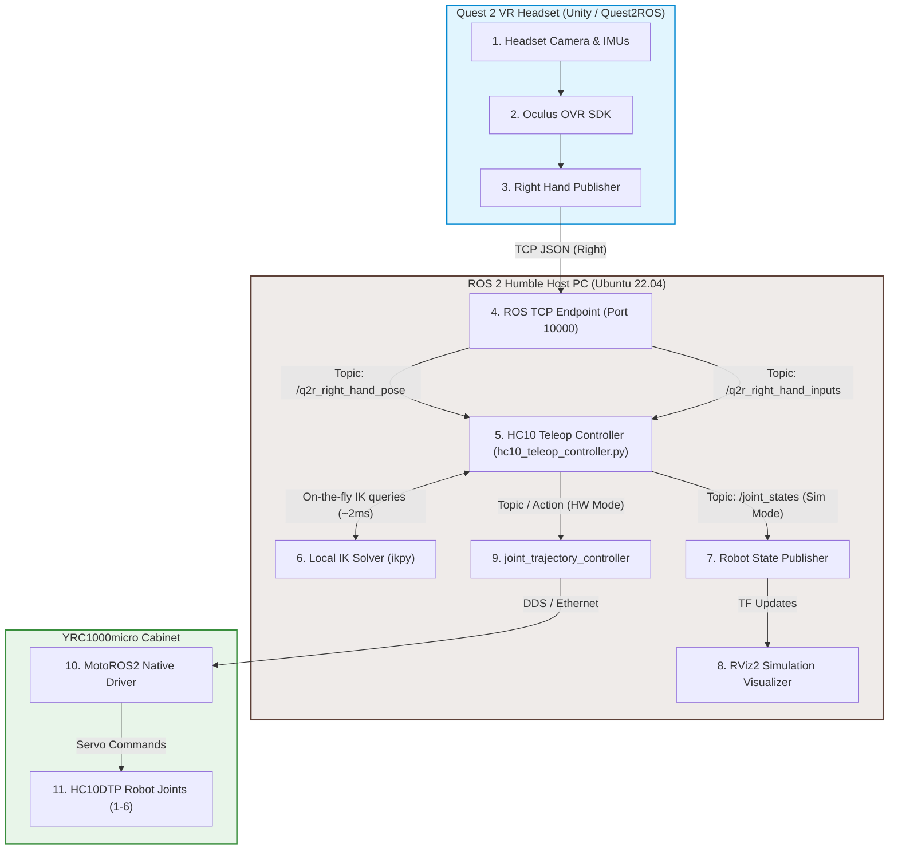

# Native ROS 2 Teleoperation for Yaskawa HC10DTP: System Architecture & Implementation Plan

This document outlines the architecture, data pipeline, coordinate mapping, and step-by-step migration plan for upgrading the Meta Quest 2 VR teleoperation system to the Yaskawa HC10DTP 6-axis collaborative robot. 

Unlike the legacy bimanual SDA10F setup (which relied on a ROS 1 bridge and a Docker container), this architecture is **100% native ROS 2 Humble**, running directly on the host machine and communicating with the YRC1000micro controller via **MotoROS2**.

---

## 1. System Topology & Data Pipeline

The upgraded system is simplified by removing all legacy ROS 1 components, Docker containers, and UDP bridges. The flow of tracking data is fully serialized through standard ROS 2 topics.



---

## 2. Spatial Mapping & Coordinate Transformations

### VR to Robot Base Coordinate Alignment
The Quest 2 VR controller tracking axes must be mapped to the HC10DTP base coordinate frame. In the legacy system:
* **Robot $X$ (Forward)** $\leftarrow$ VR $-Z$ (Backward)
* **Robot $Y$ (Left)** $\leftarrow$ VR $-X$ (Right/Left)
* **Robot $Z$ (Up)** $\leftarrow$ VR $Y$ (Up/Down)

For a single-arm 6-axis robot, we map the **Right Hand** Quest 2 controller relative motion to the HC10DTP base:
$$\vec{P}_{target\_robot} = \vec{P}_{anchor\_robot} + \text{Scale} \times \begin{bmatrix} -\Delta Z_{vr} \\ -\Delta X_{vr} \\ \Delta Y_{vr} \end{bmatrix}$$

### Hand Orientation Mapping ($R_{vr\_to\_robot}$)
To map the Quest 2 controller's relative orientation changes to the robot's end-effector (`tool0`), we use a mirroring rotation matrix $R_{vr\_to\_robot\_right}$ that converts VR rotations into local relative rotations ($q_{relative}$), which are then applied to the starting robot orientation anchor ($q_{anchor}$):

$$R_{vr\_to\_robot} = \begin{bmatrix} 
1.0 & 0.0 & 0.0 \\ 
0.0 & 0.0 & 1.0 \\ 
0.0 & -1.0 & 0.0 
\end{bmatrix}$$

$$q_{relative} = \text{Rot}(R_{vr\_to\_robot} \times \Delta \text{Rot}_{vr})$$
$$q_{target} = q_{anchor} \times q_{relative}$$

---

## 3. Local Inverse Kinematics (IK) via `ikpy`

To bypass OMPL planner latency (~200ms–2000ms) and run smooth streaming teleoperation (~30Hz), we use the Python library `ikpy` to compute IK in **~2ms** directly within the teleop node:
1. **On-the-Fly URDF Parsing**: The node uses `xacro` to parse `hc10dtp_b00.xacro` (from `motoman_hc10_support`), generates a temporary URDF file, and loads it into an `ikpy.chain.Chain` object.
2. **Chain Boundaries**: The chain is defined from the `base_link` link up to the `tool0` link.
3. **Active Joints Mask**: All 6 joints (`joint_1` to `joint_6`) are set as active (`True`), while intermediate fixed links or offsets are set as inactive (`False`).
4. **Temporal Consistency**: To prevent joint flipping or singularities, the IK solver is seeded with the current joint configuration.

---

## 4. Work Organization & File Layout

We will create a clean separation of the new HC10DTP controllers from any legacy SDA10 code:

```
ros2_ws/src/Quest2ROS2/
├── HC10DTP_TELEOP_PLAN.md          <-- [New] This Architecture Plan
├── launch/
│   ├── motoman_sim.launch.py       <-- Legacy SDA10 Sim Launcher
│   └── hc10dtp_teleop.launch.py    <-- [New] Launches Q2R ROS 2 stack for HC10DTP
└── q2r2_bringup/
    ├── motoman_sim_controller.py   <-- Legacy SDA10 Sim Controller
    └── hc10dtp_teleop_controller.py <-- [New] Teleop controller with 6-axis ikpy solver
```

---

## 5. Software Safety Clamps

Teleoperation can cause sudden movements if connection drops or coordinates warp. The following safety checks will be built directly into the ROS 2 node:

1. **Joint Velocity Clamp**: If any computed joint command jumps by more than **$0.15\text{ rad}$ (~$8.5^\circ$)** in a single $33\text{ ms}$ interval, the command is rejected, and the robot holds its position.
2. **Workspace Bounding Box**: Cartesian targets are restricted to a defined safety box around the robot (e.g., $X \in [0.2, 0.9]\text{m}$, $Y \in [-0.7, 0.7]\text{m}$, $Z \in [0.0, 1.2]\text{m}$) to prevent collisions with the mounting table or physical limits.
3. **Clutch / Deadman Switch**: Teleoperation is only active while the lower controller button (**A** or **Trigger**) is held down or toggled. Releasing it immediately freezes the robot.

---

## 6. Implementation Checklist

- [x] **Step 1: Create `HC10DTP_TELEOP_PLAN.md`** (This file) in `ros2_ws/src/Quest2ROS2/` to serve as a persistent reference.
- [x] **Step 2: Install dependencies** (Verified: `ikpy 3.4.2` and `xacro` available, ROS 2 Humble, Python 3.10).
- [x] **Step 3: Develop `hc10dtp_teleop_controller.py`** in `q2r2_bringup/`.
  - Add parameters for `sim_mode` (boolean), `scale_factor` (float), and workspace limits.
  - Setup subscriptions to `/q2r_right_hand_pose` and `/q2r_right_hand_inputs`.
  - Parse URDF/Xacro dynamically from the `motoman_hc10_support` package.
  - Setup 6-axis IK chain using `ikpy`.
  - Stream `JointState` (to `/joint_states`) and `JointTrajectory` (to `/joint_trajectory_controller/joint_trajectory`).
- [x] **Step 4: Register Node in `setup.py`** (Add `hc10dtp_teleop_controller` entry point).
- [x] **Step 5: Create launch file `hc10dtp_teleop.launch.py`** in `launch/`.
  - Loads `hc10dtp_b00.xacro` via `xacro`.
  - Launches `robot_state_publisher`.
  - Launches `ros_tcp_endpoint` (optional/integrated).
  - Launches `hc10dtp_teleop_controller`.
  - Launches RViz2 with a custom configuration.
- [x] **Step 6: Build & Test Simulation** — verified 2026-06-10 with a fake-Quest end-to-end test (`test/test_teleop_e2e.py`; IK round-trip in `test/test_hc10dtp_ik.py`):
  - IK chain round-trip: exact joint recovery, <0.001 mm position error, ~7 ms solve.
  - 8 cm VR hand raise × 1.2 scale → tool0 rose exactly 9.6 cm (X/Y unchanged).
  - Clutch-off freeze: zero joint drift under large VR pose jumps.
  - **Important**: a live MoveIt + MotoROS2 stack (`/move_group`, `/yaskawa_hc10_motion_service`, MotoROS2 `/joint_states`) is already running on DDS domain 0 — use `ROS_DOMAIN_ID=<n>` isolation for sim testing, otherwise the foreign robot state corrupts anchoring.
  - Controller changes from testing: anchor pose now computed via own-chain FK (not TF); in HW mode the node subscribes to `/joint_states` (sensor-data QoS) to mirror the real robot while the clutch is off, and does **not** publish `/joint_states` (MotoROS2 owns it).
- [ ] **Step 7: Connect to MotoROS2** on the real YRC1000micro cabinet.
  - **ALWAYS run `scripts/hw_preflight.sh` first.** A coworker operates a second HC10 on this lab network — the preflight refuses to proceed if more than one MotoROS2 node is discoverable, and warns about foreign control stacks (`move_group`, `yaskawa_hc10_motion_service`, …).
  - Coexistence plan (**decided 2026-06-11**): this project owns **`ROS_DOMAIN_ID=69`** — both the host PC (`export ROS_DOMAIN_ID=69`, in `~/.bashrc`) and the cabinet (`ros_domain_id: 69` in its `motoros2_config.yaml`, reload + reboot). The coworker keeps domain 0/default and just avoids 69. The teleop node's `joint_states_topic` / `trajectory_topic` parameters remain available as a second layer if namespacing is ever needed.
  - MotoROS2 publishes `/joint_states` best-effort; verify which motion interface the cabinet exposes (preflight prints this). Streaming teleop likely needs point-queue mode (`start_point_queue_mode` + `queue_traj_point`) or the `follow_joint_trajectory` action rather than the `/joint_trajectory_controller/joint_trajectory` topic.
