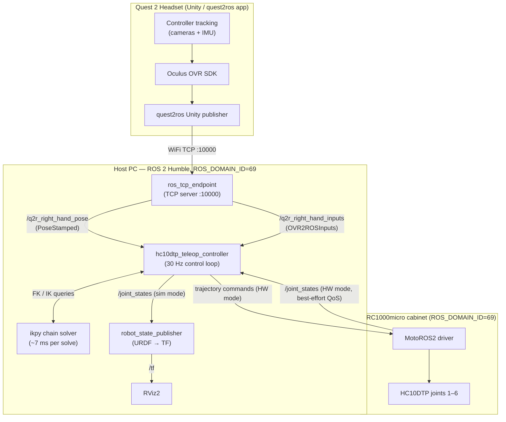

# Quest 2 → Robot VR Teleoperation + LeRobot Data Collection (ROS 2)

Real-time VR teleoperation of 6-axis robots from **Meta Quest 2** controllers, running **100% natively on ROS 2 Humble** (Ubuntu 22.04) — no ROS 1 bridge, no Docker. Hand poses stream at 30 Hz, IK is solved locally, and motion is gated by a clutch (deadman) plus software safety clamps.

The **current, active** platform is a **Universal Robots UR10e** driven through `forward_position_controller`, used to **record [LeRobot](https://github.com/huggingface/lerobot) demonstration datasets** (wrist + scene cameras + joint state/action) for training manipulation policies (ACT / Diffusion / VLA / World-Action-Models). See **[Data Collection: UR10e + LeRobot](#data-collection-ur10e--lerobot-active)** below — that's the part you want if you're here to collect data.

> **Active:** UR10e VR-teleop data collection (this README's data-collection section).
> **Paused:** the original **Yaskawa HC10DTP** native-MotoROS2 teleop — sim pipeline verified 2026-06-10, hardware bring-up shelved. Its full write-up is preserved further down ([Architecture](#architecture) onward) and in [HC10DTP_TELEOP_PLAN.md](./HC10DTP_TELEOP_PLAN.md).

---

## Data Collection: UR10e + LeRobot (active)

Teleoperate the UR10e with the Quest 2 **right** controller and record synchronized demonstrations as a LeRobot dataset. Each frame captures a **wrist camera** (Intel RealSense D435i, color + aligned depth), a **scene camera** (LUCID Triton GigE), the robot **state** (6 joint positions + end-effector pose) and the **action** (commanded joint targets). The left controller drives recording (start / stop / discard) so your right hand never leaves the robot.

### The 3-terminal workflow

Everything runs at `ROS_DOMAIN_ID=69` (terminals here auto-export it). Cameras + the LeRobot recorder are now bundled into **one** launcher (`record_session.sh`), so data collection is **3 terminals**, not 5.

```bash
# ── Terminal 1 — robot bring-up (driver + forward_position_controller + Quest TCP endpoint) ──
~/projects/LearnROS2/ros2_ws/src/Quest2ROS2/scripts/ur10e_start.sh
#   Powers the robot, releases brakes, launches the UR driver, then plays the
#   External Control URCap. Wait for the driver to report it's receiving commands.
#   (On the pendant: make sure the robot is in Remote mode.)

# ── Terminal 2 — the teleop "brain" (Quest → IK → joint commands) ──
ros2 run q2r2_bringup ur10e_proximity_teleop --ros-args -p sim_mode:=false
#   ⚠ ALWAYS pass `-p sim_mode:=false` — the node DEFAULTS to sim_mode:=true,
#   which publishes a 2nd /joint_states and makes RViz "glitch" without moving
#   the real robot. Start with -p scale_factor:=0.5 for a first session.

# ── Terminal 3 — both cameras + the LeRobot recorder ──
~/projects/LearnROS2/ros2_ws/src/Quest2ROS2/scripts/record_session.sh "open the fuel door" fuel_door
#   Launches the D435i (aligned depth ON), the LUCID camera, waits until every
#   stream is actually publishing, then starts the recorder. The 2nd arg is the
#   dataset folder name under ~/lerobot_datasets/. Close ArenaView first (a GigE
#   camera allows only one controlling app).
```

Usage of the recorder launcher:

```
record_session.sh "<task description>" [dataset_name] [extra recorder args]
```
- **`"<task description>"`** — the natural-language label stored on every frame (used by language-conditioned policies). Keep it consistent within a dataset.
- **`dataset_name`** — the folder under `~/lerobot_datasets/`. **Reusing a name appends** more episodes to that dataset (it prints `APPENDING episodes`); a new name starts a fresh one. One dataset per task, e.g. `fuel_door`, `charge_plug`.

### Recording an episode (left controller)

The teleop node owns all buttons and is the single source of truth; the recorder just follows its `/episode_event` + `/record_active` signals.

| Control | Action |
|---|---|
| **Right A** | clutch / anchor — teleop only moves the robot while engaged; re-anchors on every engage (no jump) |
| **Right B** | start / stop the current episode |
| **Left X** | discard the current episode (mistake — nothing is saved) |
| **Left Y** | e-stop (disengage + discard the open episode) |

On **stop**, the episode is encoded from RAM to disk (video + parquet + depth PNGs) — you'll hear *"Encoding episode N… saved."* Because each episode lives in RAM until saved, keep **sessions** long but individual **episodes** short (≈ tens of seconds); save often.

### Inspecting episodes (Rerun)

Confirm the cameras **and** the motor recordings (state/action) look right:

```bash
~/projects/LearnROS2/ros2_ws/src/Quest2ROS2/scripts/viz_episode.sh 50 fuel_door
```
Opens the Rerun viewer for episode 50: both camera streams plus timeseries plots of `observation.state` (13) and `action` (6). The `action` traces should closely shadow the joint-position traces — tight tracking = clean teleop data.

### Recovering after a crash / power-loss

LeRobot keeps one parquet writer open for the whole session and only writes the file **footer** on a clean close, so a crash mid-session leaves the current `file-NNN.parquet` (data + meta) full of intact episodes but **unreadable** (`Parquet magic bytes not found in footer`). **The episodes are not lost.** Recover them:

```bash
# back up first (small — skip videos)
cp -a ~/lerobot_datasets/<task>/{meta,data,depth} /some/backup/

# dry-run scan, then repair (saves each original as *.corrupt.bak)
~/lerobot_venv/bin/python ~/projects/LearnROS2/ros2_ws/src/Quest2ROS2/scripts/recover_truncated_parquet.py ~/lerobot_datasets/<task>
~/lerobot_venv/bin/python ~/projects/LearnROS2/ros2_ws/src/Quest2ROS2/scripts/recover_truncated_parquet.py ~/lerobot_datasets/<task> --apply
```
It rebuilds the missing footer from the page stream (cloning the schema from an intact sibling file) and self-validates before touching anything. Then just re-run `record_session.sh` with the same dataset name to resume — new episodes go into a fresh file and never touch the recovered one. (Recovered all 96 episodes after a real crash, zero loss.)

### Where the data lives / storage

- **Local:** `~/lerobot_datasets/<dataset_name>/` (video under `videos/`, state+action under `data/`, 16-bit depth PNGs under `depth/`, metadata under `meta/`). This is what `record_session.sh` writes and what training reads.
- **Company server (lakeFS):** datasets are versioned to the lab **lakeFS** server (mTLS, certs in `~/certs/`) with the `lake` CLI:
  ```bash
  ~/lakefs-ros/venv/bin/lake push ~/lerobot_datasets/<dataset> advanced-robotic-ai data \
      --message '<dataset>: N episodes' --extra-metadata '{"robot":"ur10e","task":"<t>","episodes":N}'
  ```
  It uploads → commits on the branch → merges into `main`. The branch **must already exist**; the host defaults to `10.0.0.78:8445` (don't pass `--host`). Passing `--extra-metadata` avoids a harmless `commit: no changes` error on the final metadata step. Keep the local copy until verified.

### Camera setup notes

- **RealSense D435i (wrist):** standard `realsense2_camera`; `record_session.sh` launches it with `align_depth.enable:=true` at `640x480` (aligned depth follows). Missing `align_depth` is the classic cause of 0-frame "missing depth" episodes.
- **LUCID Triton (scene):** a raw GigE Vision (PoE) camera bridged into ROS via a custom `arena_api` node (`scripts/lucid_camera_node.py`, launched by `scripts/lucid_camera_start.sh`). It runs in `~/lucid_venv` and publishes `/lucid/image_raw`. ArenaView **must be closed** before the node can open the camera. Full setup quirks are documented in the script headers.

---

## Evaluation: running a trained policy (UR10e)

Once a policy is trained (e.g. π0 fine-tuned on a recorded dataset), evaluate it **autonomously on the robot** to get a real success rate and find failure modes. The policy drives the arm — **no teleop node, no Quest headset**; you score each trial from the laptop **keyboard**. This is the mirror of recording: `model → robot → measure` instead of `human → robot → save`.

### How inference is served (over the network)

This laptop has no GPU, so the model runs on a separate **GPU machine** exposing an **openpi `WebsocketPolicyServer`**. The eval node sends observations (wrist + scene image + 13-dim state) over the LAN and gets back an **action chunk** (6 joint targets × horizon), which it streams to `/forward_position_controller/commands`.

- The eval node runs in **`~/eval_venv`** (has `openpi-client`) — *separate* from `~/lerobot_venv`, because openpi-client pins `numpy<2` while lerobot needs `numpy≥2`.
- **Network:** GPU server e.g. `192.168.6.1:8000`; the laptop is dual-homed on the wired switch (`192.168.1.202` for robot/camera **+** a secondary `192.168.6.2` to reach the GPU). The server must bind **`0.0.0.0`**. The GPU box may not answer ping (ICMP firewall) — test the **port**: `nc -vz 192.168.6.1 8000`.
- **Observation keys** are defined by the server's openpi data config — confirm them and pass `--openpi-wrist-key/--scene-key/--state-key/--prompt-key/--action-key` if the defaults don't match (the client logs server metadata on connect).

### Staged test (safe → live)

```bash
# 1) Aliveness probe — NO robot, NO cameras. Validates server + obs keys + latency.
~/eval_venv/bin/python scripts/policy_ping.py --policy-host 192.168.6.1 --policy-port 8000

# 2) Dry-run — real cameras, but the robot NEVER moves (logs the action it would send).
eval_session.sh "open the fuel door" fuel_door --policy-host 192.168.6.1 --policy-port 8000 --dry-run

# 3) Live — cautious for an undertrained model; hand on the pendant e-stop.
eval_session.sh "open the fuel door" fuel_door --policy-host 192.168.6.1 --policy-port 8000 \
    --max-joint-step 0.04 --run-seconds 10 --trials 2
```

### Running it (2 terminals on the laptop)

```bash
# T1 — robot bring-up (driver + forward_position_controller + opens the External Control "gate")
scripts/ur10e_start.sh                 # wait for "Ready to receive commands"; pendant in Remote mode

# T2 — cameras + eval node (the bridge to the GPU). NO teleop node during eval.
scripts/eval_session.sh "open the fuel door" fuel_door --policy-host 192.168.6.1 --policy-port 8000
```

Per trial the loop is: **auto-home → you reset the scene + press `r` → policy runs → you press `t`/`f`**. Keyboard: `r`=ready/go, `s`=stop early, `t`=success, `f`=fail. Safety: a per-tick joint-delta clamp (`--max-joint-step`) rejects wild policy outputs; the **physical pendant e-stop is the real backstop**.

### Output

Each session writes `~/eval_runs/<dataset>_<timestamp>/`: a `results.csv` (trial, result, seconds, video) and a per-trial `.mp4`, and prints the **success rate** + the **failed trial numbers** so you know which videos to review. Per-query latency (mean/p95/max) is logged so you can confirm the network path is fast enough.

### The eval flywheel

`collect → train → evaluate → mine failure modes → collect targeted demos for what fails → retrain`. Eval logs are a **diagnosis** (they tell you *what* to record next), not training data — the fix is the new targeted demos. This closed loop is what makes data collection efficient instead of "record more and hope."

---

## Architecture



Two mutually exclusive output paths, selected by the `sim_mode` parameter:

| Mode | Robot state source | Command sink | `/joint_states` publisher |
|---|---|---|---|
| `sim_mode:=true` | own integrated state | `/joint_states` → RViz | the teleop controller |
| `sim_mode:=false` | real robot via MotoROS2 | trajectory interface → cabinet | **MotoROS2 only** (controller never publishes it) |

---

## The Nodes

### 1. `ros_tcp_endpoint` (Unity bridge)
TCP server on port `10000`. The Quest 2 headset (running the quest2ros Unity app, configured with this PC's IP) connects over WiFi and its messages are re-published as native ROS 2 topics:
- `/q2r_right_hand_pose` — `geometry_msgs/PoseStamped`, controller pose in Unity frame (Y-up, Z-forward)
- `/q2r_right_hand_inputs` — `quest2ros/OVR2ROSInputs`, buttons / triggers / thumbstick

### 2. `hc10dtp_teleop_controller` (the brain — `q2r2_bringup/hc10dtp_teleop_controller.py`)
A single 30 Hz control-loop node. Per cycle:

1. **Clutch gate** — teleop runs only while enabled. The lower button (A) **toggles** enable/disable. Every engage re-anchors both the VR pose and the robot pose, so the robot never jumps to "catch up" with where your hand wandered while disengaged.
2. **Anchoring** — on engage, stores the current VR pose and the robot's end-effector pose. The robot pose comes from **the controller's own ikpy forward kinematics** (never TF), so a foreign `robot_state_publisher` or second robot on the network cannot corrupt it.
3. **Coordinate mapping** — relative VR displacement → robot base frame (`robot X ← −VR Z`, `robot Y ← −VR X`, `robot Z ← VR Y`), scaled by `scale_factor`. Relative VR rotation is conjugated into the robot frame by the fixed mapping matrix `R_vr_to_robot` and applied to the anchored orientation (full math in [HC10DTP_TELEOP_PLAN.md](./HC10DTP_TELEOP_PLAN.md)).
4. **IK** — `ikpy` solves position + full orientation against the chain parsed live from `hc10dtp_b00.xacro` (`motoman_hc10_support`), **seeded with the current joint state** for temporal consistency (prevents configuration flips).
5. **Safety clamps** — see [Safety](#safety-systems).
6. **Output** — `/joint_states` (sim) or a `JointTrajectory` point with 40 ms `time_from_start` (hardware).

In hardware mode it additionally **mirrors the real robot**: it subscribes to `/joint_states` (sensor-data QoS, matching MotoROS2's best-effort publisher) and adopts the real joint values whenever the clutch is disengaged — teleop always resumes from where the robot actually is.

**Parameters**

| Parameter | Default | Meaning |
|---|---|---|
| `sim_mode` | `true` | RViz-only vs real-robot output |
| `scale_factor` | `1.2` | hand-motion amplification |
| `publish_rate` | `30.0` | control loop Hz |
| `max_joint_delta` | `0.15` | max rad per joint per cycle before a solution is rejected |
| `x_min/x_max` | `0.15 / 0.95` | workspace box X (m) |
| `y_min/y_max` | `-0.75 / 0.75` | workspace box Y (m) |
| `z_min/z_max` | `-0.15 / 1.25` | workspace box Z (m) |
| `joint_states_topic` | `/joint_states` | retarget to a namespaced robot, e.g. `/yuval_hc10/joint_states` |
| `trajectory_topic` | `/joint_trajectory_controller/joint_trajectory` | command sink (will be adapted to the cabinet's actual MotoROS2 interface during bring-up) |

### 3. `robot_state_publisher`
Loads the HC10DTP URDF (processed from `hc10dtp_b00.xacro`) and broadcasts TF from `/joint_states`. Drives the RViz model.

### 4. `rviz2`
Visualization. Launched with `QT_QPA_PLATFORM=xcb` because RViz2 freezes/black-screens under GNOME Wayland (do **not** set `LIBGL_ALWAYS_SOFTWARE=1` on the host — that kills hardware OpenGL).

### 5. MotoROS2 (runs on the cabinet, not the PC)
Yaskawa's native ROS 2 driver, executing as a MotoPlus task on the YRC1000micro. Publishes `/joint_states` (best-effort) and `/robot_status`, and exposes motion interfaces (`follow_joint_trajectory` action / point-queue services). Its DDS settings live in `motoros2_config.yaml` **on the controller**.

---

## Safety Systems

| Layer | Mechanism | Effect |
|---|---|---|
| Clutch (deadman) | A-button toggle, re-anchors on every engage | release = robot freezes instantly; engage never jumps |
| Joint-jump clamp | any joint moving > `0.15 rad` in one 33 ms cycle | IK solution rejected, robot holds position |
| Workspace box | Cartesian target clipped to configured X/Y/Z box | can't be driven into the table / out of reach |
| State mirroring (HW) | adopts real `/joint_states` while clutch is off | commands always continue from the robot's true pose |
| HW preflight | [`scripts/hw_preflight.sh`](./scripts/hw_preflight.sh) | refuses to run with 2+ robots visible; audits the DDS domain before any motion |

Verified in sim (see `test/`): exact IK round-trip; 8 cm hand raise × 1.2 scale → tool0 +9.6 cm exactly; **zero** joint drift under violent VR jumps with the clutch off.

---

## DDS Domain Policy (two HC10s in one lab!)

A coworker operates a **second HC10 on the same network**. ROS 2 / DDS auto-discovers everything on the same domain ID, so separation is by domain:

| Who | `ROS_DOMAIN_ID` |
|---|---|
| **This project** — PC **and** our cabinet's MotoROS2 | **69** |
| Coworker | 0 (DDS default) or anything ≠ 69 — just not 69 |

Why a fixed unique ID (and not sharing 0 + being careful): domain 0 is where *everyone who forgets to export the variable* lands. On 69, his nodes can connect/disconnect whenever he wants and we are mutually invisible — no coordination needed beyond "69 is taken".

**Setup, once:**
1. PC: `echo 'export ROS_DOMAIN_ID=69' >> ~/.bashrc` (new terminals pick it up).
2. Cabinet: set `ros_domain_id: 69` in `motoros2_config.yaml` on the YRC1000micro (edit the YAML, reload via USB/pendant per the MotoROS2 docs, reboot the cabinet). **Without this step the PC and robot won't see each other.**
3. Tell the coworker 69 is ours.

`scripts/hw_preflight.sh` stays as the belt-and-suspenders check: if it ever reports two MotoROS2 nodes on domain 69, something is misconfigured — it exits and blocks teleop.

---

## How to Run Everything

### 0. Build (once per code change)
```bash
cd ~/projects/LearnROS2/ros2_ws
source /opt/ros/humble/setup.bash
colcon build --packages-select quest2ros q2r2_bringup ros_tcp_endpoint motoman_hc10_support motoman_resources
source install/setup.bash
```
Dependencies: ROS 2 Humble, `ikpy` (`pip install ikpy`), `xacro`.

### 1. Simulation (no robot, no headset needed)
```bash
export ROS_DOMAIN_ID=69
ros2 launch q2r2_bringup hc10dtp_sim.launch.py        # rviz:=false for headless
```
Starts `robot_state_publisher`, the teleop controller in `sim_mode:=true`, and RViz2. Drive it from a real headset (start the endpoint too — step 2) or run the automated fake-Quest test:
```bash
export ROS_DOMAIN_ID=69
python3 src/Quest2ROS2/test/test_teleop_e2e.py        # expects the sim launch to be up
python3 src/Quest2ROS2/test/test_hc10dtp_ik.py        # standalone IK round-trip check
```

### 2. Full stack with the headset (still simulated robot)
```bash
export ROS_DOMAIN_ID=69
ros2 launch q2r2_bringup hc10dtp_teleop.launch.py sim_mode:=true
```
Adds `ros_tcp_endpoint` on port `10000`. In the Quest 2 quest2ros app, set the ROS IP to this PC's WiFi address. Verify data: `ros2 topic hz /q2r_right_hand_pose`.

### 3. Running on the real robot
```bash
# 1) Power the cabinet, let MotoROS2 boot.
# 2) ALWAYS preflight first:
export ROS_DOMAIN_ID=69
./src/Quest2ROS2/scripts/hw_preflight.sh
#    - exactly ONE MotoROS2 node must be visible
#    - note which motion interface it exposes
# 3) Launch teleop in hardware mode:
ros2 launch q2r2_bringup hc10dtp_teleop.launch.py sim_mode:=false
```
First session: start with `scale_factor:=0.5`, hand near anchor, small slow moves.

> ⚠️ Bring-up note: MotoROS2 typically exposes a `follow_joint_trajectory` **action** and point-queue **services** rather than the trajectory topic this controller currently publishes. The preflight prints what the cabinet actually offers; wiring the controller to it is the one remaining integration step (plan, Step 7).

### Teleoperating
1. Hold the right controller comfortably, press **A** once → clutch **ENABLED** (logged), robot anchors to your hand.
2. Move your hand — the robot's tool follows (1.2× scaled). Rotate — the tool rotates.
3. Press **A** again → **DISABLED**, robot freezes; reposition your hand freely, press **A** to re-engage with zero jump.

---

## Repository Layout

```
Quest2ROS2/                        # ROS 2 package: q2r2_bringup
├── README.md                      # this file
├── HC10DTP_TELEOP_PLAN.md         # living plan: architecture math, checklist, verification log
├── HC10DTP_AGENT_PROMPT.md        # original build spec
├── q2r2_bringup/
│   ├── hc10dtp_teleop_controller.py   # the teleop node (see above)
│   └── ...                            # legacy SDA10-era nodes
├── launch/
│   ├── hc10dtp_sim.launch.py          # sim: RSP + controller + RViz
│   └── hc10dtp_teleop.launch.py       # full: + ros_tcp_endpoint, sim_mode arg
├── scripts/
│   └── hw_preflight.sh                # mandatory pre-hardware-session check
├── test/
│   ├── test_hc10dtp_ik.py             # ikpy chain FK/IK round-trip
│   └── test_teleop_e2e.py             # fake-Quest end-to-end sim test
└── Files_for_msg_pkg/                 # source of quest2ros msg definitions
```
Related workspace packages: `quest2ros` (the `OVR2ROSInputs`/haptics messages), `ros_tcp_endpoint`, `motoman_hc10_support` (URDF/meshes), `motoman_resources` (RViz config).

---

## Troubleshooting

| Symptom | Cause / fix |
|---|---|
| RViz2 black/frozen viewport on GNOME | Wayland/Qt conflict — launch files already force `QT_QPA_PLATFORM=xcb`. Never set `LIBGL_ALWAYS_SOFTWARE=1` on the host. |
| `ros2 topic list` shows ghosts of dead nodes | the ROS 2 daemon caches discovery: `ros2 daemon stop`, retry |
| Robot/joints jump around in RViz, tests flap | duplicate node instances fighting (e.g. two controllers publishing `/joint_states`): `pgrep -af hc10dtp` and kill strays |
| `[SAFETY] Joint delta command rejected` spam | anchor inconsistent with state, or hand moved too fast — re-toggle the clutch to re-anchor |
| PC sees nothing from the cabinet | domain mismatch — PC and `motoros2_config.yaml` must both say 69 |
| No `/q2r_*` topics | headset and PC not on the same WiFi / wrong ROS IP in the Quest app / endpoint not running |

---

## Legacy

This repo previously targeted the dual-arm **Motoman SDA10** through a ROS 1 bridge + Docker (see [TELEOP_ARCHITECTURE.md](./TELEOP_ARCHITECTURE.md) and git history). That path was abandoned: the DX100 streaming interface proved intermittently unreliable (non-deterministic command drops, ~30% execution rate in controlled tests). The HC10DTP + MotoROS2 stack replaces all of it.
