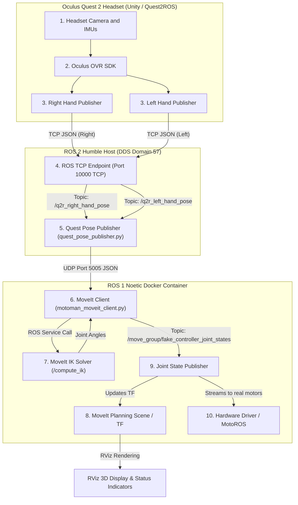

# Quest 2 Bimanual Robot Teleoperation: System Architecture & Data Pipeline

This document provides an exhaustive technical breakdown of the dual-arm VR teleoperation system. It details how tracking data travels from the Meta Quest 2 headset to the MoveIt simulation and eventually to the physical robot joints.

---

## 1. System Topology & Data Pipeline

The pipeline crosses three distinct execution environments:
1. **Oculus VR Runtime**: Runs on the Quest 2 headset.
2. **ROS 2 Humble Workspace**: Runs on the Host Ubuntu system (ROS_DOMAIN_ID=57).
3. **ROS 1 Noetic Workspace**: Runs inside a Docker Container to interface with the Motoman/MoveIt simulation environment.



---

## 2. Step-by-Step Data Walkthrough

### Step 1: Telemetry Acquisition (Headset)
* **What happens**: The Meta Quest 2 headset uses its inside-out cameras to track the 3D position and orientation of the Left and Right controllers relative to the headset's starting position.
* **Component**: The `Quest2ROS` Unity app gathers these coordinates at **72Hz–90Hz**.
* **Protocol**: Sends raw serialized JSON packets over TCP to the host machine.

### Step 2: ROS 2 Message Conversion (Host)
* **What happens**: The `ros_tcp_endpoint` node listens on TCP port `10000`. It converts the incoming Unity telemetry streams into native ROS 2 messages:
  * `/q2r_{left|right}_hand_pose` (Type: `geometry_msgs/PoseStamped`)
  * `/q2r_{left|right}_hand_inputs` (Type: `quest2ros/OVR2ROSInputs` representing buttons, joysticks, trigger values).

### Step 3: Relative Offset & Rotation Mapping (`quest_pose_publisher.py`)
* **What happens**: The `quest_pose_publisher` node processes these raw messages.
  * **Anchoring**: When tracking is disabled, it does not send tracking telemetry. When the user presses the lower button (**A** for Right, **X** for Left), it locks the starting VR pose as `first_quest_pos` and `first_quest_ori`.
  * **Relative Offset**: It computes how far the controller has moved relative to that locked anchor.
  * **Rotation Mapping**: It applies mirror matrices ($R_{vr\_to\_robot}$) to map VR rotations to Yaskawa joint rotations.
  * **UDP Transmission**: It formats this relative target into a JSON payload and streams it over UDP to port `5005` on `127.0.0.1`.
  * **Heartbeat**: If tracking is paused, it streams an inactive heartbeat (`"active": false`) at **10Hz** to keep the ROS 1 client synced.

#### UDP Payload Schema:
```json
{
  "side": "left",
  "active": true,
  "anchor": false,
  "home": false,
  "x": 0.152,
  "y": -0.043,
  "z": 0.089,
  "qx": 0.012,
  "qy": -0.082,
  "qz": 0.991,
  "qw": 0.098
}
```

### Step 4: UDP Receiver Thread & State Management (`motoman_moveit_client.py`)
* **What happens**: A dedicated receiver thread binds to UDP port `5005` in the ROS 1 Docker container. It parses JSON payloads and handles states:
  * **Homing Command (`home: true`)**: If the upper button (**B** for Right, **Y** for Left) is pressed while tracking is disabled, the script intercepts this, sets `home_requested[side] = True`, and instantly commands the 7 joint states of that arm to `0.0`.
  * **Resuming Command (`active: true, anchor: true`)**: When tracking is enabled, the client locks the **robot's current physical/sim joint TCP coordinate** (`arm_{side}_link_tool0`) in the planning scene as the starting robot anchor.
  * **Status & Spheres**: Publishes floating text markers (`LEFT: ACTIVE/INACTIVE`) and transparent feedback spheres (Red for Right, Blue for Left) to RViz at 30Hz.

### Step 5: Inverse Kinematics Solving (MoveIt)
* **What happens**: The client node calculates the absolute 3D target in robot space:
  $$\vec{P}_{target} = \vec{P}_{anchor\_robot} + (\text{Scale} \times \vec{\Delta P}_{vr})$$
  $$q_{target} = q_{anchor\_robot} \times q_{relative}$$
* It constructs a `GetPositionIKRequest` and calls the `/compute_ik` service. If IK fails (e.g. collision bounds), it automatically retries with collision checks disabled as a safety bypass before giving up.

### Step 6: Bimanual Conflict-Free Joint Publishing
* **What happens**: Previously, MoveIt returned the joint angles of the *entire* robot. Publishing the full joint state would cause the Left arm update to overwrite the Right arm joints (and vice-versa), making them fight and lock up.
* **Component**: We now filter the solved joint array by joint name prefix (`arm_left_` or `arm_right_`).
* **Protocol**: Publishes a subset `JointState` message containing **only the 7 joints of the active arm** to `/move_group/fake_controller_joint_states`. ROS's `joint_state_publisher` merges these smoothly.

### Step 7: Hardware Execution (Physical Controller Interface)
* **What happens**: To move the real robot, the joint values published to `/move_group/fake_controller_joint_states` must be streamed to the real motors.
* **Protocol**: A hardware bridge node (such as MotoROS running on the Yaskawa DX100 controller) subscribes to these joint states and streams them directly over a high-speed TCP socket interface to the DX100 cabinet at 30Hz–50Hz.

---

## 3. Coordinate & Mirroring Math

### Translation Mapping
Movements are mapped directly from VR relative displacement to robot world axes:
* **Robot $X$ (Forward)** $\leftarrow$ VR $X$ (Right/Left)
* **Robot $Y$ (Left)** $\leftarrow$ VR $Y$ (Up/Down)
* **Robot $Z$ (Up)** $\leftarrow$ VR $Z$ (Forward/Backward)

> [!NOTE]
> Scaling is applied to amplify physical reach: $\vec{P}_{target} = \vec{P}_{anchor} + (\text{Scale} \times \vec{P}_{offset})$

### Rotation Mappings ($R_{vr\_to\_robot}$)
To route VR controller rotations to the correct joint motions, different matrices are used to account for mirror symmetry:

#### Left Arm Matrix (Yaw to Green, normal pitch)
$$R_{vr\_to\_robot\_left} = \begin{bmatrix} 
1.0 & 0.0 & 0.0 \\ 
0.0 & 0.0 & 1.0 \\ 
0.0 & 1.0 & 0.0 
\end{bmatrix}$$

#### Right Arm Matrix (Yaw to Green, inverted pitch for symmetry)
$$R_{vr\_to\_robot\_right} = \begin{bmatrix} 
1.0 & 0.0 & 0.0 \\ 
0.0 & 0.0 & 1.0 \\ 
0.0 & -1.0 & 0.0 
\end{bmatrix}$$

Applying these matrices converts VR relative rotations into local relative rotations ($q_{relative}$) which are multiplied onto the local frame of the gripper anchor:
$$q_{target} = q_{anchor} \times q_{relative}$$

---

## 4. Real-Time Safety & Latency Optimization (OMPL vs. Direct IK)

### The Latency Challenge with OMPL
In standard MoveIt configurations, motion planning is handled by **OMPL** (Open Motion Planning Library). OMPL constructs search trees to find a complete, optimized path from point A to point B while verifying collision safety for every intermediate step. 
* **The Drawback**: OMPL planning takes between **200ms and 2000ms+**, which introduces huge control lag. This latency makes real-time hand-tracking teleoperation physically impossible and extremely dangerous.

### The Low-Latency Direct IK Streaming Approach
To solve this, we bypass OMPL entirely and stream targets directly using **Inverse Kinematics** (`/compute_ik` service calls):
1. **Low-Latency solving**: The `/compute_ik` service calculates the instantaneous joint angles for the hand's new position in **2ms–5ms**, maintaining a steady **30Hz** (33ms step) control loop.
2. **Posture Seeding**: The solver is seeded with the arm's current joints. This forces it to select the closest mathematical solution, keeping motions smooth and continuous.

### Real-Time Safety Guards

Since OMPL path-checking is bypassed, safety is guaranteed by three real-time software and hardware fuses:

#### Guard 1: Joint Delta Safety Clamp (Software Fuse)
In `motoman_moveit_client.py`, the joint positions resolved by the IK service are evaluated before publication.
* **The Threshold**: If any single joint commands a change of more than **0.15 radians (~8.5 degrees)** within a single 33ms step, it is classified as a joint jump (elbow flip) or singularity.
* **Action**: The target is immediately rejected, and the previous joint states are held. This keeps the robot stationary during singular transitions.

#### Guard 2: Real-Time Collision Filtering
* When a target is sent, it is first evaluated using `avoid_collisions = True` inside MoveIt. If the target posture creates a collision with the table, the torso, or the opposite arm, the IK service rejects it, preventing the robot from executing the motion.

#### Guard 3: Controller Dev-Limit Guard (Hardware Fuse)
* If a joint command somehow bypasses the software clamps and commands a sudden jump, the Yaskawa DX100 cabinet's internal acceleration controller will immediately detect a **deviation over-limit** and execute a Category 0 hardware safety stop (cutting power to the motors instantly).

---

## 5. Node Checklist & Launch Sequence

To run this pipeline, the following terminals and nodes must be open:

| Node / Executable | Environment | Purpose | Protocol / Topic |
| :--- | :--- | :--- | :--- |
| **Quest2ROS Unity App** | Meta Quest 2 | Tracks controllers and reads buttons | Wifi TCP to Port 10000 |
| **`default_server_endpoint`** | Host (ROS 2) | ROS TCP endpoint mapping Unity stream | Publishes `/q2r_*` |
| **`quest_pose_publisher.py`** | Host (ROS 2) | Computes relative anchors, outputs UDP | UDP to Port 5005 |
| **MoveIt Sim / RViz** | Docker (ROS 1) | Runs robot URDF, TF, and `/compute_ik` | `/compute_ik` Service |
| **`motoman_moveit_client.py`** | Docker (ROS 1) | Receives UDP, queries IK, publishes states | `/move_group/fake_controller_joint_states` |
