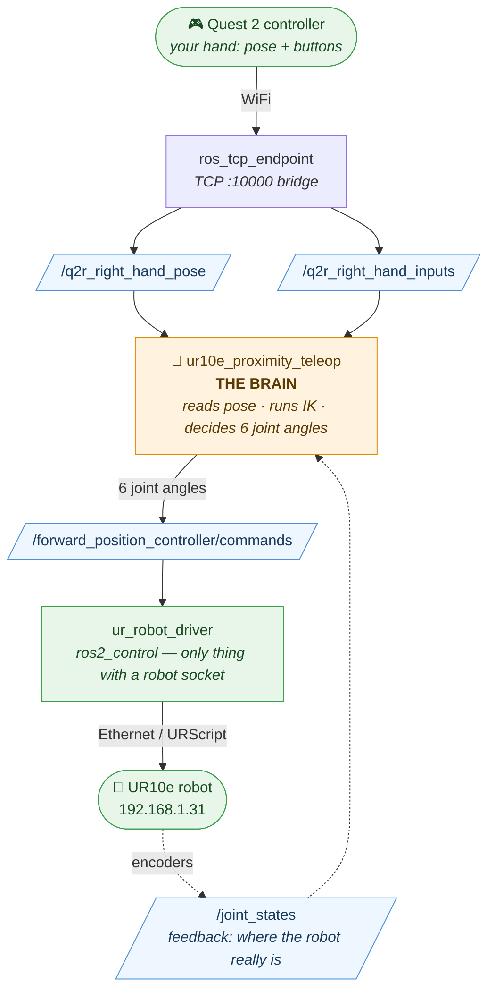
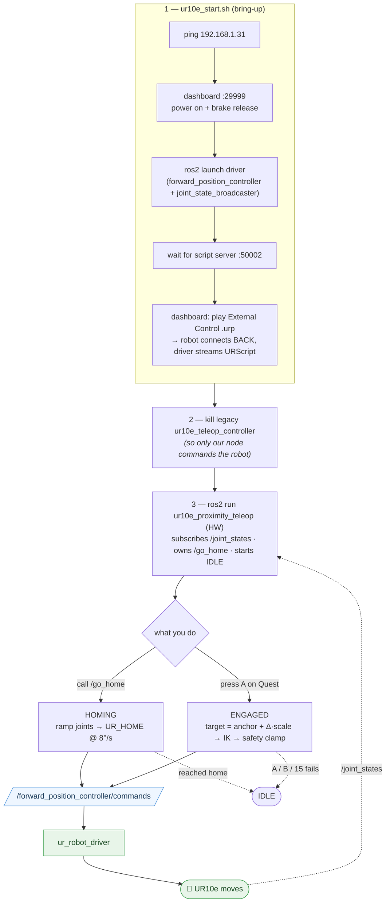
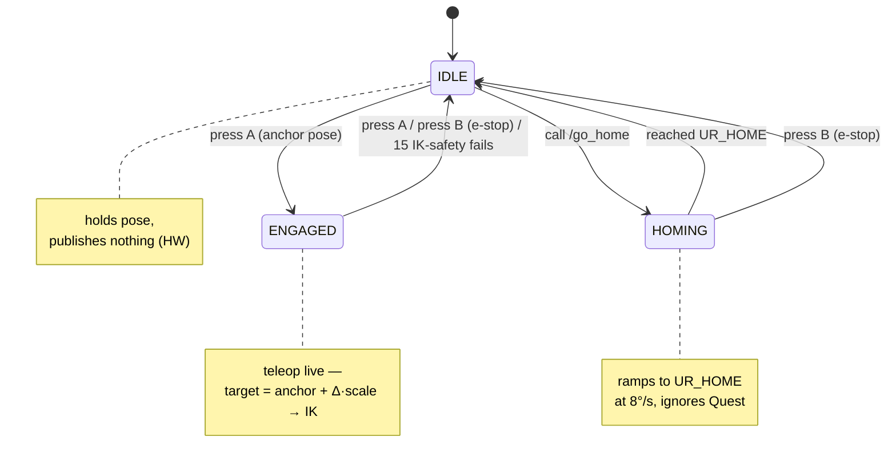

# UR10e VR Teleoperation — Architecture & Operator's Guide

A from-scratch explanation of how the whole UR10e teleop system works: every
process, every connection, what each command does, and how data flows from
your hand to the robot and back. Read top to bottom the first time; after that
it's a reference.

---

## Part 0 — The ONE mental model (read this first)

Everything is a **loop**. Your hand moves, the robot follows, the robot reports
where it is, and that feedback closes the loop. Hold this picture in your head:



> Solid arrows = command path (hand → robot). Dotted arrows = feedback path (robot → brain).

Two key truths that explain 90% of the confusion:

1. **The teleop node never talks to the robot directly.** It only publishes a
   list of 6 joint angles to a ROS topic. A *separate* program — the UR driver —
   is the only thing that has a network socket to the robot.
2. **Nodes don't "call" each other.** They publish/subscribe to named **topics**
   (a mailbox) and call **services** (a request/response). Nobody has a pointer
   to anybody. They only agree on topic *names* and message *types*. This is why
   you can start them in any order, on different terminals, even different PCs.

---

## Part 1 — Two kinds of things you run: nodes vs scripts

You'll run two fundamentally different kinds of commands. Knowing which is which
removes most "wait, where do I type this" confusion.

### a) ROS 2 nodes — long-running programs that talk over topics

A **node** is a process that participates in the ROS graph. It stays alive,
publishing and subscribing, until you Ctrl+C it. You start nodes two ways:

| Command | What it does | Example |
|---|---|---|
| `ros2 run <pkg> <exe>` | Start **one** node | `ros2 run q2r2_bringup ur10e_proximity_teleop` |
| `ros2 launch <pkg> <file>` | Start **many** nodes at once, from a launch file | `ros2 launch q2r2_bringup ur10e_proximity_sim.launch.py` |

A **launch file** is just a Python recipe that says "start these N nodes with
these parameters." `ur10e_proximity_sim.launch.py` starts 3 nodes
(robot_state_publisher + teleop + rviz) in one go.

### b) Shell scripts (`.sh`) — orchestration glue

A script like `ur10e_start.sh` is **not** a ROS node. It's a bash program that:
- talks to the robot's **dashboard server** over a raw TCP socket (port 29999)
  to power on / release brakes / play a program — this is pure UR protocol, no ROS;
- then calls `ros2 launch` to bring up the driver;
- then waits for a port to open and plays the External Control program.

So a script *orchestrates* — it runs ROS commands AND non-ROS robot commands in
the right order. You run it once; it does a sequence and (for `ur10e_start.sh`)
keeps the driver alive in the foreground.

> **Rule of thumb:** if it stays running and shows up in `ros2 node list`, it's a
> node. If it's a `.sh` that does a sequence of steps and exits (or hands off to
> a launch), it's a script.

### c) One-shot ROS CLI commands

`ros2 topic echo`, `ros2 param set`, `ros2 service call` — these are quick
one-shot commands you fire from any terminal to *inspect* or *poke* the running
graph. They start, do one thing, and exit. They're how you talk to nodes by hand.

---

## Part 2 — The cast of processes (who is who)

When the full HW teleop is running, these processes are alive at once. Run
`ROS_DOMAIN_ID=69 ros2 node list` to see them.

| Process / node | Started by | Job |
|---|---|---|
| **ur10e_proximity_teleop** | you (`ros2 run`) | **The brain.** Reads hand pose, runs IK, outputs 6 joint angles, owns `/go_home`. |
| **ros_tcp_endpoint** (`unity_endpoint`) | `ur10e_start.sh`'s launch | Bridge between the Quest app (TCP 10000) and ROS topics. Translates Quest messages ↔ ROS messages. |
| **ur_robot_driver** (`ur_ros2_control_node` + `controller_manager`) | `ur10e_start.sh`'s launch | The only thing with a socket to the robot. Runs ros2_control. |
| **joint_state_broadcaster** | the driver (a controller) | Reads real joint encoders, publishes `/joint_states`. |
| **forward_position_controller** | the driver (a controller) | Receives your `/...commands`, forwards them to the robot as position targets. |
| **robot_state_publisher** | launch (sim) | Turns the URDF + joint angles into TF frames so RViz can draw the arm. |
| **rviz2** | launch | Visualization only. Draws the robot model + your `/teleop_markers`. |
| **ur10e_teleop_controller** (LEGACY) | `ur10e_start.sh`'s launch | ⚠️ An *old* teleop node we don't use. It also publishes joint commands → fights our node. **We kill it.** |

> ⚠️ This is why Terminal 2 exists: the driver launch *also* spawns the legacy
> controller, and two nodes publishing to `/forward_position_controller/commands`
> would fight. We `kill -9` the legacy one; the driver itself survives.

---

## Part 3 — The wiring (topics & services)

This is the actual ROS graph. Each arrow is a topic (publish→subscribe) or a
service call. You can verify any of these live with `ros2 topic info <name>`.

| Name | Type | From → To | Carries |
|---|---|---|---|
| `/q2r_right_hand_pose` | `geometry_msgs/PoseStamped` | endpoint → teleop | hand position + orientation |
| `/q2r_right_hand_inputs` | `quest2ros/OVR2ROSInputs` | endpoint → teleop | A/B buttons, triggers, sticks |
| `/joint_states` | `sensor_msgs/JointState` | driver → teleop *(HW)* | where the robot really is |
| `/forward_position_controller/commands` | `std_msgs/Float64MultiArray` | teleop → driver *(HW)* | 6 target joint angles |
| `/joint_states` | `sensor_msgs/JointState` | teleop → rviz *(SIM)* | commanded angles (no robot) |
| `/teleop_markers` | `visualization_msgs/MarkerArray` | teleop → rviz | status text, TCP & hand axes |
| `/go_home` | `std_srvs/srv/Trigger` | **you** → teleop | "ramp to home" request |

Note `/joint_states` plays opposite roles in sim vs HW (see Part 6) — that's the
single most important difference between the two modes.

---

## Part 4 — What actually happens in the two HW terminal commands

### Terminal 1: `ROS_DOMAIN_ID=69 ./scripts/ur10e_start.sh`

Step by step, this script:

1. **Pings** `192.168.1.31` to confirm the robot is reachable.
2. Opens a TCP socket to the **dashboard server** (port 29999) and sends UR
   commands (this is *not* ROS — it's UR's own text protocol):
   - `stop`, then if stuck `power off` → wait, then `power on` → wait for IDLE,
     then `brake release` → wait for RUNNING. Now the arm is energized.
3. Runs `ros2 launch q2r2_bringup ur10e_teleop.launch.py headless_mode:=false`,
   which starts: the **UR driver** (with `forward_position_controller` as the
   initial controller), the **TCP endpoint**, the **legacy controller**, and rviz.
4. Waits for the driver's **script server (port 50002)** to open — that means the
   driver is ready for the robot to connect back.
5. Opens the dashboard again and does `load /programs/uv_external_control.urp`
   then `play`. That program contains the **External Control URCap** block; when
   it runs, the robot opens a connection *back* to the driver and starts obeying
   the URScript the driver feeds it. **Now the loop is live.**

When you see **"Ready to receive commands"**, the robot is listening.

### Terminal 2: `kill -9 $(pgrep -f ".../ur10e_teleop_controller")`

Kills the legacy controller node that the launch spawned (step 3). The driver and
everything else keep running. Without this, two nodes publish conflicting joint
commands to the robot.

### Terminal 3: `ros2 run q2r2_bringup ur10e_proximity_teleop -p sim_mode:=false ...`

Starts **the brain**. On startup it:
- builds the IK chain (Part 5a),
- subscribes to the Quest topics and to `/joint_states`,
- creates the `/go_home` service,
- starts a 30 Hz timer (`_tick`) and sits in **IDLE** (publishing nothing).

It now knows the robot's real pose (via `/joint_states`) and waits for you to
press **A** or call `/go_home`.

---

## Part 4½ — The whole lifecycle at a glance

How the three commands chain together, and the two ways the brain ends up
driving the robot (homing vs teleop) — both funnel through the same command
topic → driver → robot.



---

## Part 5 — Inside the brain (`ur10e_proximity_teleop.py`)

### 5a. Building the IK chain (once, at startup)

`_init_chain()` finds the `ur_description` package, runs **xacro** to generate the
UR10e URDF, walks the joint tree from `base_link` → `tool0` to get the 6 joint
names in order, and hands the URDF to **ikpy** to build a kinematic chain. From
then on:
- **FK** (`_fk`): given 6 joint angles → where is the TCP (position + orientation)?
- **IK** (`chain.inverse_kinematics`): given a desired TCP pose → what 6 joint
  angles get there? (seeded with the current angles so it picks the nearest solution.)

### 5b. The 30 Hz tick — a 3-state machine

Every 1/30 s, `_tick()` runs. The state is one of:



- **IDLE** — does nothing but draw markers. In HW mode it publishes *no* commands,
  so the robot holds position. Mirrors the real robot pose from `/joint_states`.
- **ENGAGED** — teleop is live (see 5c).
- **HOMING** — ignores the Quest entirely; each tick nudges every joint a small
  step toward `UR_HOME` at 8 °/s until it arrives, then drops to IDLE. This is why
  homing works even with no headset connected.

### 5c. The clutch: why the robot never jumps when you engage

When you press **A** (IDLE → ENGAGED), the node saves **four anchors**:
- `quest_anchor` — where your hand is *right now*
- `tcp_anchor` — where the robot TCP is *right now*
- `rot_anchor`, `quest_rot_anchor` — same for orientation

From then on it commands **relative** motion:
```
target_TCP = tcp_anchor + R_pos · (current_hand − quest_anchor) · scale
```
At the instant of engaging, `current_hand == quest_anchor`, so the delta is zero
and `target == tcp_anchor` — **no jump.** As you move, only the *difference* from
your starting hand position is applied. Re-pressing A re-anchors, so you can
"clutch": disengage, reposition your arm comfortably, re-engage, continue.

`scale_factor` multiplies that delta: `0.5` = robot moves half as far as your hand
(precise, safe). `1.0` = 1:1. `>1` = amplified.

### 5d. Orientation: world-frame mirroring (the hard-won fix)

`_map_rotation()` maps your hand's rotation to a TCP rotation. The version that
works is **world-frame (extrinsic)**: the TCP mirrors how your hand rotates *in
the room*, not about its own axes. See `ur10e_teleop_orientation_config.md` for
the full why. `pos_axis_map`, `ori_axis_map`, and `world_frame_ori` are all
**live-tunable** (Part 7) — change them while running; they take effect on the
next A-press re-anchor.

### 5e. The safety clamp

After IK solves, the node checks every joint: if any would move more than
`max_joint_delta` (default 0.10 rad ≈ 6°) in a single 1/30 s tick, it **rejects**
that solution and counts a failure. After `disengage_fail_count` (15) failures in
a row it auto-disengages to IDLE. This is what stops a bad IK solution from
snapping the robot. It limits *per-tick* motion → smooth, bounded speed.

### 5f. Output (the sim/HW fork)

`_publish_outputs()`:
- **SIM:** always publishes the commanded angles to `/joint_states` → RViz animates.
- **HW:** publishes to `/forward_position_controller/commands` **only when ENGAGED
  or HOMING**. In IDLE it stays silent so the robot holds.

---

## Part 6 — SIM vs HW: the crucial difference

| | SIM (`sim_mode:=true`) | HW (`sim_mode:=false`) |
|---|---|---|
| Robot driver running? | No | Yes (`ur10e_start.sh`) |
| Who publishes `/joint_states`? | **the teleop node** (its own commands) | **the robot** (real encoders) |
| Where do commands go? | nowhere (just `/joint_states` for rviz) | `/forward_position_controller/commands` → driver → robot |
| `js_received` starts as | `True` (no feedback needed) | `False` (waits for real feedback) |
| Risk | none | real robot moves — e-stop in hand |

In SIM the node is a closed loop with itself: it publishes angles to
`/joint_states`, robot_state_publisher turns that into TF, RViz draws it. There is
no robot. In HW the node *listens* to `/joint_states` (from the robot) when IDLE
so it always knows the true pose, and only *drives* when you engage.

---

## Part 7 — Command cheat-sheet

Always export the domain first (every terminal): `export ROS_DOMAIN_ID=69`

```bash
# ── See the graph ────────────────────────────────────────────────
ros2 node list                       # all running nodes
ros2 topic list                      # all topics
ros2 topic info /joint_states        # who publishes/subscribes
ros2 topic echo /q2r_right_hand_pose # watch hand pose stream
ros2 topic hz /joint_states          # is the robot publishing? rate?

# ── Talk to the teleop node ──────────────────────────────────────
ros2 param list /ur10e_proximity_teleop
ros2 param get /ur10e_proximity_teleop world_frame_ori
ros2 param set /ur10e_proximity_teleop scale_factor 0.3
ros2 param set -- /ur10e_proximity_teleop ori_axis_map "x,-z,y"   # note the -- for leading minus
ros2 service call /go_home std_srvs/srv/Trigger

# ── Run things ───────────────────────────────────────────────────
ros2 launch q2r2_bringup ur10e_proximity_sim.launch.py            # SIM (3 nodes)
ros2 run q2r2_bringup ur10e_proximity_teleop --ros-args -p sim_mode:=false -p scale_factor:=0.5
ros2 run ros_tcp_endpoint default_server_endpoint --ros-args -p ROS_IP:=0.0.0.0 -p ROS_TCP_PORT:=10000
```

> **`param set` vs restart:** `pos/ori_axis_map`, `world_frame_ori`, `scale_factor`
> are live — `param set` works without restart. **Any change to the .py source
> needs a node restart** (Python caches the code at process start; `colcon build`
> alone doesn't reload a running node).

---

## Part 8 — Startup recipes (copy-paste)

### SIM (no robot)
```bash
# T1
ROS_DOMAIN_ID=69 ros2 launch q2r2_bringup ur10e_proximity_sim.launch.py
# wait for "IK chain" + "Ready" in the log, THEN:
# T2
source ~/projects/LearnROS2/ros2_ws/install/setup.bash
ROS_DOMAIN_ID=69 ros2 run ros_tcp_endpoint default_server_endpoint \
    --ros-args -p ROS_IP:=0.0.0.0 -p ROS_TCP_PORT:=10000
# connect Quest app to <PC-ip>:10000, press A, move hand
```

### HW (real robot) — e-stop in hand, pendant speed low
```bash
# T1 — power on + driver + External Control
cd ~/projects/LearnROS2/ros2_ws/src/Quest2ROS2
ROS_DOMAIN_ID=69 ./scripts/ur10e_start.sh        # wait "Ready to receive commands"
# T2 — kill the legacy controller (driver survives)
kill -9 $(pgrep -f "q2r2_bringup/lib/q2r2_bringup/ur10e_teleop_controller")
# T3 — the brain
source ~/projects/LearnROS2/ros2_ws/install/setup.bash
ROS_DOMAIN_ID=69 ros2 run q2r2_bringup ur10e_proximity_teleop --ros-args -p sim_mode:=false -p scale_factor:=0.5
# T4 — home first (endpoint for the Quest is already running from T1)
ROS_DOMAIN_ID=69 ros2 service call /go_home std_srvs/srv/Trigger
# then connect Quest to <PC-ip>:10000, press A, move slowly
```

---

## Part 9 — Mental checklist when something's wrong

1. **Robot won't move on engage?** Is the node in HW mode (`sim_mode:=false`)? Is
   it actually ENGAGED (green text in RViz)? Is `forward_position_controller`
   the active controller (`ros2 control list_controllers`)?
2. **`/go_home` "did nothing"?** Was the robot already at home? Is the node stuck
   because `/joint_states` never arrived (`ros2 topic hz /joint_states`)?
3. **Quest not controlling?** Is the endpoint up on 10000? Is the Quest app
   pointed at the right PC IP? `ros2 topic hz /q2r_right_hand_pose`.
4. **Changed a param but nothing happened?** Did you change *source* (needs
   restart) or a *param* (live)? Did you re-press A to re-anchor?
5. **Two things fighting for the robot?** Did the legacy controller get killed?
   `ros2 node list | grep teleop_controller`.

---

*Companion docs: `UR10e_teleop_progress.md` (bring-up history),
`ur10e_teleop_orientation_config.md` (the orientation math).*
